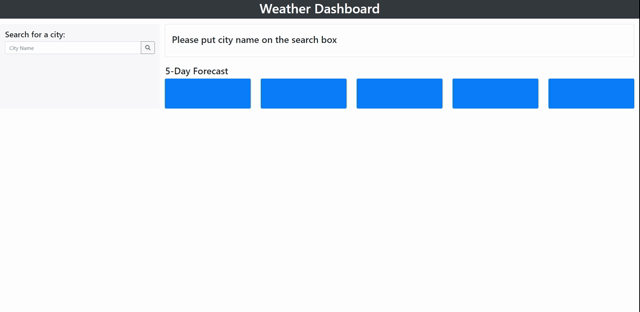

# homework_06_weather_dashboard

## Objective
To create a simple weather dashboard application by retriving data from another application's API and using in the context.
The dashboard will run in the browser and feature dynamically updated HTML and CSS.

- user input a city to get the current and future conditions for that city 
- the current weather will show city name, date, wether conditions icon, temperature, humidity, wind speed and the UV index
- same information will be presented on the 5-days forecast
- color code on the weather information indicates whether the conditions are favorable, moderate, or severe
- user can click on the search history section to see the information of that city again.
- the city search record will be still displayed even the browser get refreshed.

## Application

### Github Repository URL
https://github.com/thammaraku/homework_06_weather_dashboard

### Github Page URL
https://thammaraku.github.io/homework_06_weather_dashboard/

### Screenshots

## Knowledge learned from this assignment
1. Know how to generate AJAX query to receive data from another application's API
2. Retriving data from JSON to use on the web page
3. DOM manipualtion
4. Local storage get and set
5. Moment javascript to convert unix time
6. new HTML tags i.e table tag
7. using bootstrap on the layout work
8. good practice javascript structure